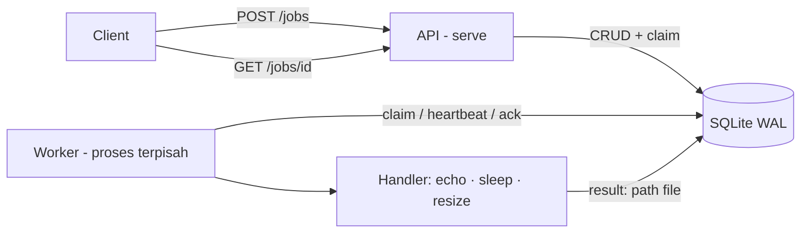

# jobqueue

Job queue + worker sederhana di Go. HTTP API buat submit tugas, worker pool buat proses, persist ke SQLite (WAL) — API & worker proses terpisah berbagi satu file DB.

## Fitur

- Submit job via `POST /jobs`, cek status via `GET /jobs/{id}`
- Worker pool terpisah dari API (multi-process, satu file SQLite WAL)
- Retry dengan exponential backoff, dead letter setelah max attempts
- Visibility timeout + heartbeat: worker crash → job di-reclaim
- Graceful shutdown: selesaikan job in-flight sebelum keluar
- Delivery at-least-once → handler wajib idempotent

## Cara jalan

```sh
go run ./cmd/jobqueue serve    # API di :8080
go run ./cmd/jobqueue worker   # worker pool
```

## API

| Method | Path | Keterangan |
|---|---|---|
| POST | `/jobs` | Body `{"type":"echo","payload":{},"max_attempts":3,"run_at":"RFC3339"}` → 202 + job |
| GET | `/jobs/{id}` | 200 job, 404 jika tidak ada |
| GET | `/jobs?status=pending&limit=50` | List job (limit 1..1000, default 100) |
| GET | `/healthz` | 200 `ok` |

Tipe job bawaan:
- `echo` — log payload.
- `sleep` — tidur sesuai `{"ms":100}`.
- `resize` — ukur ulang gambar. Payload `{"src":"path/atau/url","widths":[320,640],"format":"jpeg|png","outdir":"out"}` (`format` kosong = ikut sumber; gif → jpeg). Batas: 20 MiB, 100 megapiksel, maks 10 width. Hasil (daftar path file) tersimpan di field `result` job.

## Milestone

- [x] M1 Store: SQLite WAL, job CRUD, antrian FIFO
- [x] M2 Worker core: claim, ack, retry, dead letter
- [x] M3 API: submit, status, list
- [x] M4 Resilience: graceful shutdown, visibility timeout
- [x] M5 Handlers: echo, sleep, resize
- [x] M6 Test: integration test end-to-end

## Arsitektur



Dua proses (bukan dua goroutine): `serve` dan `worker` buka file SQLite yang sama. Job punya lease (`visibility`, default 60s) yang diperpanjang heartbeat; worker crash → lease lewat → proses lain reclaim. Delivery at-least-once, handler wajib idempotent.

## Development

```sh
go test ./...          # unit + integration test end-to-end
go test -race ./...    # dengan race detector
./scripts/smoke_m3.sh   # E2E: serve + worker 2 proses, curl sampai job done
./scripts/e2e_resize.sh # E2E: resize via API, verifikasi file + result
```

## Referensi

Job adalah state machine: `pending → running → done` (sukses), `pending → running → pending` (retry dengan backoff 2^n detik, cap 5 menit), atau `→ dead` (habis `max_attempts` / lease expired di percobaan terakhir).
