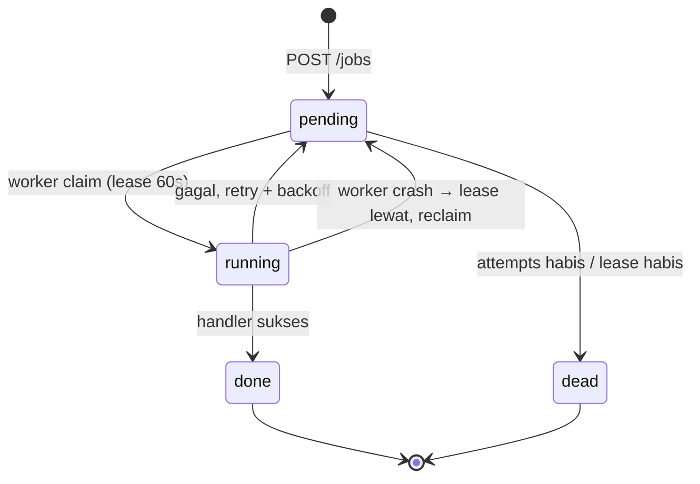
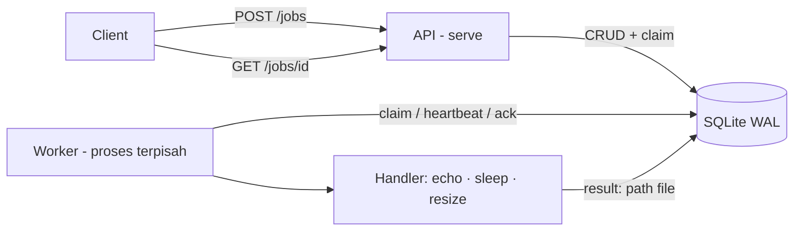

# jobqueue

Job queue sederhana di Go: **HTTP API menerima tugas, worker pool memprosesnya di proses terpisah, state disimpan di SQLite.** Tugas tidak hilang walau proses crash dan request user tidak pernah menunggu kerja berat.

## Apa ini, buat apa?

Contoh nyata: endpoint upload foto — server harus resize ke 5 ukuran. Kalau dikerjakan langsung di request, user menunggu lama; kalau server mati di tengah jalan, pekerjaan hilang. `jobqueue` memecahnya:

- **`jobqueue serve`** (API) hanya menerima tugas dan langsung membalas `202 accepted` — request tetap cepat.
- **`jobqueue worker`** mengambil tugas dari antrian dan memprosesnya — boleh banyak proses, boleh ditambah worker-nya.
- **SQLite (WAL)** menyimpan antrian dan status — proses crash tinggal dinyalakan lagi, tugas dilanjut (retry / reclaim otomatis).

Cocok untuk:

- proses upload: resize gambar, generate thumbnail
- kirim email / notifikasi massal tanpa memperlambat request
- generate laporan periodik
- scraping atau tugas rutin yang butuh retry otomatis

Kurang cocok: butuh skala multi-node (pakai queue berbasis Redis/Postgres seperti River atau Faktory), atau tugas ringan sekali jalan (goroutine biasa sudah cukup).

## Fitur

- Submit job via `POST /jobs`, cek status via `GET /jobs/{id}`
- Worker pool terpisah dari API (multi-process, satu file SQLite WAL)
- Retry dengan exponential backoff (2^n detik, cap 5 menit), dead letter setelah max attempts
- Visibility timeout + heartbeat: worker crash → job di-reclaim proses lain
- Graceful shutdown: selesaikan job in-flight sebelum keluar
- Delivery at-least-once → handler wajib idempotent
- Handler bawaan: `echo`, `sleep`, `resize` (dengan hasil di `result`)

## Quick start

Prasyarat: [Go](https://go.dev/dl/) 1.22+ (routing `GET /jobs/{id}` pakai stdlib Go 1.22).

```sh
git clone https://github.com/yogaaaa123/jobqueue.git
cd jobqueue
```

Terminal 1 — API:

```sh
go run ./cmd/jobqueue serve      # http://localhost:8080, DB: jobqueue.db
```

Terminal 2 — worker (file `-db` harus sama dengan serve):

```sh
go run ./cmd/jobqueue worker
```

Terminal 3 — submit tugas pertama:

```sh
curl -X POST localhost:8080/jobs \
  -H 'Content-Type: application/json' \
  -d '{"type":"echo","payload":{"msg":"halo"}}'
# → 202 {"id":"18d9...","status":"pending",...}

curl localhost:8080/jobs/18d9...        # poll sampai "status":"done"
```

Contoh nyata — resize gambar (`foto.jpg` ada di folder yang sama dengan worker):

```sh
curl -X POST localhost:8080/jobs \
  -H 'Content-Type: application/json' \
  -d '{"type":"resize","payload":{"src":"foto.jpg","widths":[320,640,1280]}}'
# hasil: out/<job-id>-320.jpg dst.; daftar path ada di field "result" job
```

### Flag CLI

| Perintah | Flag | Default | Keterangan |
|---|---|---|---|
| `serve` | `-db` | `jobqueue.db` | file SQLite |
| | `-addr` | `:8080` | alamat listen |
| `worker` | `-db` | `jobqueue.db` | file SQLite (harus sama dengan serve) |
| | `-n` | `4` | jumlah goroutine worker |
| | `-poll` | `200ms` | interval poll saat antrian kosong |
| | `-visibility` | `60s` | lease job running tanpa heartbeat |
| | `-outdir` | `out` | folder hasil handler resize |

## API

| Method | Path | Keterangan |
|---|---|---|
| POST | `/jobs` | Submit job → **202** + job. Body: `type` (wajib), `payload`, `max_attempts` (0 = default atau 1..10), `run_at` (RFC3339, default sekarang) |
| GET | `/jobs/{id}` | Detail job → **200**; tidak ada → **404** |
| GET | `/jobs?status=pending&limit=50` | List job → **200** (limit 1..1000, default 100; kosong → `[]`) |
| GET | `/healthz` | Health check → **200** `ok` |

Error selalu berformat `{"error":"pesan"}` dengan status 400 (validasi), 404, atau 500. Body request dibatasi 1 MiB.

### Contoh job

```json
{
  "id": "18d9c3b20a4e5f6d7c8b9a0e1f2a3b4c",
  "type": "resize",
  "payload": {"src": "foto.jpg", "widths": [320, 640]},
  "status": "done",
  "attempts": 1,
  "max_attempts": 3,
  "run_at": "2026-09-29T10:00:00Z",
  "created_at": "2026-09-29T10:00:00Z",
  "updated_at": "2026-09-29T10:00:01Z",
  "result": "[\"out/18d9...-320.jpg\",\"out/18d9...-640.jpg\"]"
}
```

Field penting: `status` (`pending` → `running` → `done`/`dead`), `attempts` (sudah berapa kali diambil worker), `last_error` (alasan retry/akhir gagal), `result` (hasil handler, JSON string).

### Tipe job bawaan

| Tipe | Payload | Keterangan |
|---|---|---|
| `echo` | bebas | Log payload — buat uji koneksi |
| `sleep` | `{"ms":100}` | Tidur N milidetik (default 100) — buat simulasi kerja |
| `resize` | `{"src","widths","format?","outdir?"}` | Ukur ulang gambar, hasil di `out/{id}-{width}.{ext}` |

Detail `resize`:

- `src`: path file lokal **atau** `http(s)://` URL (timeout 30s, maks 20 MiB)
- `widths`: 1..4096 px, maks 10 ukuran; tinggi ikut rasio
- `format`: `jpeg` \| `png`; kosong = ikut sumber (gif → jpeg)
- Sumber maks 100 megapiksel (anti decompression bomb)
- Hasil (daftar path file) tersimpan sebagai JSON array di `result`

## Cara kerja

### Alur satu job



- **Retry**: handler error → job kembali `pending` dengan jeda `2^n` detik (2s, 4s, 8s... cap 5 menit), sampai `max_attempts` (default 3) habis → `dead` (dead letter, cek `last_error`).
- **Crash safety**: setiap claim punya lease (`-visibility`, default 60s) yang diperpanjang heartbeat selama handler jalan. Worker mati → lease lewat → worker manapun `reclaim` job itu jadi `pending` lagi. Kalau attempts sudah habis saat lease mati → langsung `dead`.
- **At-least-once**: job bisa terproses dua kali pada kasus ekstrem (mis. handler lebih lambat dari lease) → tulis handler idempotent.
- **Shutdown**: `SIGINT`/`SIGTERM` → API berhenti terima koneksi baru (5s), worker selesaikan job in-flight dulu.

### Arsitektur



Dua proses terpisah (bukan dua goroutine) berbagi satu file SQLite WAL — writer terserialisasi + `busy_timeout`, jadi `serve` bisa jalan di mesin lain asal file DB-nya dibagi. Worker mengambil job lewat `UPDATE ... RETURNING` atomik: tidak ada job yang dobel diambil.

### Struktur project

```
cmd/jobqueue/         CLI: subcommand serve & worker
internal/store/       SQLite: job CRUD, claim, lease/heartbeat, reclaim
internal/worker/      pool goroutine, retry backoff, dead letter, panic recover
internal/api/         HTTP API (net/http, routing Go 1.22)
internal/handlers/    handler bawaan: echo, sleep, resize
integration_test.go   test E2E lewat HTTP beneran
scripts/              smoke test & E2E shell
```

## Development

```sh
go test ./...           # unit + integration test end-to-end
go test -race ./...     # dengan race detector
go vet ./...            # static check
./scripts/smoke_m3.sh   # E2E: serve + worker 2 proses, curl sampai job done
./scripts/e2e_resize.sh # E2E: resize via API, verifikasi file + result
```

Konvensi: PR per milestone, commit ikut Conventional Commits (`feat:`, `fix:`, `docs:`, `test:`).

## Milestone

- [x] M1 Store: SQLite WAL, job CRUD, antrian FIFO
- [x] M2 Worker core: claim, ack, retry, dead letter
- [x] M3 API: submit, status, list
- [x] M4 Resilience: graceful shutdown, visibility timeout
- [x] M5 Handlers: echo, sleep, resize
- [x] M6 Test: integration test end-to-end
